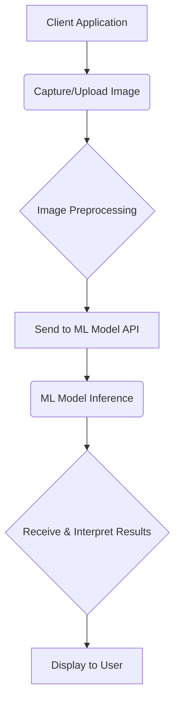

# Developer Integration Instructions: Shine Skin Collective ML Model

## 1. Introduction

This document outlines the steps for integrating the trained Machine Learning (ML) model, developed using the synthetic skin condition dataset from the `shine-skin-collective` repository, into external applications. The ML model is designed for **multi-label classification of skin conditions** and **prediction of severity levels** based on facial images.

## 2. Model Capabilities

The ML model provides the following outputs for a given input facial image:

-   **Skin Condition Classification**: Identifies the presence or absence of 7 primary skin conditions (Acne, Aging, Fine Lines & Wrinkles, Hyperpigmentation, Pore Size, Redness, Textured Skin).
-   **Severity Prediction**: Predicts the severity level for each detected skin condition (e.g., mild, moderate, severe, advanced, early_signs, slight).
-   **Demographic Inference (Optional)**: Depending on the model's final architecture, it may also provide inferred demographic information such as age group, skin tone, and gender.

## 3. Prerequisites

Before integrating the ML model, ensure the following are in place:

-   **Access to Trained Model**: The deployed ML model endpoint (e.g., REST API URL) or local model files.
-   **API Key (if applicable)**: If the model is exposed via an API, an authentication key will be required.
-   **Development Environment**: A suitable environment for your application (e.g., Python, Node.js, mobile development environment).
-   **Image Preprocessing Libraries**: Libraries capable of image manipulation (resizing, normalization) compatible with your chosen development language.

## 4. Integration Architecture (Conceptual)

Typically, the integration will follow a client-server model:

1.  **Client Application**: Captures or uploads a facial image.
2.  **Image Preprocessing**: The image is preprocessed to match the model's input requirements.
3.  **API Call**: The preprocessed image data is sent to the ML model's API endpoint.
4.  **Model Inference**: The ML model processes the image and returns predictions.
5.  **Result Handling**: The client application receives and interprets the model's output.



## 5. Integration Steps

### 5.1. Image Preparation

The input image must be prepared to match the model's expected format. This typically involves:

1.  **Resizing**: Resize the image to the model's input dimensions (e.g., 224x224, 256x256 pixels).
2.  **Color Channel Conversion**: Ensure the image is in the correct color format (e.g., RGB).
3.  **Normalization**: Normalize pixel values to the range expected by the model (e.g., [0, 1] or [-1, 1]).

**Example (Python using Pillow and NumPy):**

```python
from PIL import Image
import numpy as np

def preprocess_image(image_path, target_size=(224, 224)):
    img = Image.open(image_path).convert('RGB')
    img = img.resize(target_size)
    img_array = np.array(img).astype('float32')
    img_array = img_array / 255.0  # Normalize to [0, 1]
    img_array = np.expand_dims(img_array, axis=0) # Add batch dimension
    return img_array

# Usage:
# preprocessed_img = preprocess_image('path/to/your/image.jpg')
```

### 5.2. API Interaction

Assuming the ML model is exposed via a REST API, interaction will involve sending a POST request with the preprocessed image data.

**Example (Python using `requests` library):**

```python
import requests
import json

MODEL_API_URL = "YOUR_MODEL_API_ENDPOINT"
API_KEY = "YOUR_API_KEY" # If authentication is required

def predict_skin_conditions(image_data):
    headers = {
        "Content-Type": "application/json",
        "Authorization": f"Bearer {API_KEY}" # Example for Bearer token
    }
    
    # Convert numpy array to list for JSON serialization
    image_data_list = image_data.tolist()

    payload = {
        "image": image_data_list
    }

    try:
        response = requests.post(MODEL_API_URL, headers=headers, json=payload)
        response.raise_for_status() # Raise an exception for HTTP errors
        return response.json()
    except requests.exceptions.RequestException as e:
        print(f"API request failed: {e}")
        return None

# Usage:
# preprocessed_img = preprocess_image('path/to/your/image.jpg')
# predictions = predict_skin_conditions(preprocessed_img)
# if predictions:
#     print(json.dumps(predictions, indent=2))
```

### 5.3. Interpreting Model Output

The model's output will be a JSON object, similar to the `training_annotations` structure found in the synthetic dataset metadata. An example output structure is provided below:

```json
{
    "image_filename": "input_image.jpg",
    "classification_results": {
        "acne": {"present": true, "confidence": 0.95},
        "fine_lines_wrinkles": {"present": false, "confidence": 0.05},
        "aging": {"present": true, "confidence": 0.88},
        "hyperpigmentation": {"present": false, "confidence": 0.12},
        "pore_size": {"present": true, "confidence": 0.70},
        "redness": {"present": false, "confidence": 0.08},
        "textured_skin": {"present": true, "confidence": 0.65}
    },
    "severity_results": {
        "acne": {"level": "moderate", "confidence": 0.80},
        "aging": {"level": "early_signs", "confidence": 0.75},
        "pore_size": {"level": "mild", "confidence": 0.60},
        "textured_skin": {"level": "slight", "confidence": 0.55}
    },
    "demographics_inference": {
        "age_group": "young_adult",
        "skin_tone": "fair",
        "gender": "female"
    }
}
```

Your application should parse this JSON and use the `present` flags for classification and `level` for severity to display relevant information to the user.

## 6. Error Handling

Implement robust error handling for:

-   **Network Issues**: Handle `requests.exceptions.ConnectionError` and `requests.exceptions.Timeout`.
-   **API Errors**: Check HTTP status codes (e.g., 4xx for client errors, 5xx for server errors) and parse error messages from the API response.
-   **Invalid Input**: Ensure images are valid and correctly preprocessed before sending to the API.

## 7. Future Considerations

-   **Model Versioning**: Implement a strategy for managing different versions of the ML model.
-   **Scalability**: Design the integration to handle increased load, potentially using asynchronous API calls or load balancing.
-   **Feedback Loop**: Consider incorporating a mechanism for collecting user feedback to continuously improve model performance.

## Supabase Schema (MVP)

```sql
create table if not exists analyses (
  id text primary key,
  created_at timestamp with time zone default now(),
  metadata jsonb,
  concerns jsonb not null,
  recommendations jsonb
);

create table if not exists analysis_embeddings (
  analysis_id text primary key references analyses(id) on delete cascade,
  vector real[] not null,
  metadata jsonb
);
```